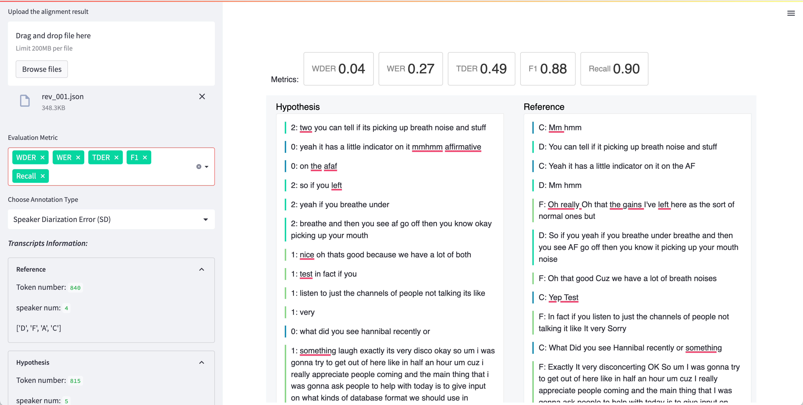
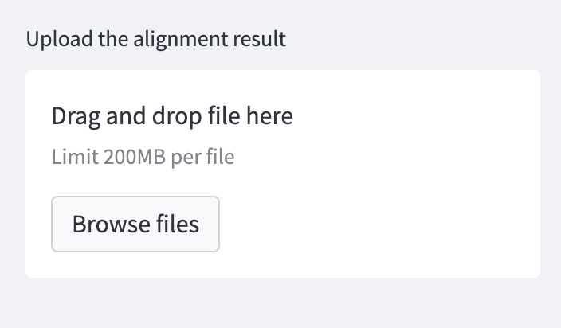

# TranscribeView

**TranscribeView** is a web-based tool designed to evaluate and visualize errors in speech recognition and speaker
diarization. It provides an interface for assessing both speaker recognition and speaker diarization errors. The system
leverages the **align4d** package, a powerful multiple sequence alignment tool, to accurately map reference and hypothesis
transcripts. By combining these features, TranscribeView aims to aid in the advancement of data-driven conversational AI
research.

## Interface

<p align="center">

</p>

The above illustration shows a working example of the TranscribeView interface, employing a reference transcript from
the <a href="https://groups.inf.ed.ac.uk/ami/icsi/">ICSI Corpus</a> for demonstration purposes. This interface is
organized into distinct sections, each serving a specific purpose:

### Components:

1. **Sidebar**: This is located on the left side of the interface. It hosts several crucial features:

    - **Dropdown Menu for Evaluation Metrics**: Allows users to select the specific evaluation metrics they wish to apply to the transcript analysis.
  
    - **Dropdown Menu for Annotation Types**: Offers users a variety of annotation types to choose from for their specific analysis requirements.
  
    - **Transcript Statistics**: Presents users with vital statistical data including the token count, number of speakers, speaker identities, and speaker alignment.

2. **Metrics**: This is situated at the top of the right section of the interface. It displays the score of the selected evaluation metric, providing real-time analysis feedback.

3. **Visualization Area**: Constitutes the majority of the right part of the interface. It's divided into two columns and visualizes the selected transcript and its corresponding analysis.

## Installation

```shell
git clone https://github.com/emorynlp/TranscribeView.git
cd TranscribeView
pip install --upgrade pip
pip install -r requirements.txt
```

## Quick Example
Here is an quick example you can play with using provided alignment data. 

```shell
streamlit run transcribeView.py
```
The TranscribeView interface will pop up in the browser.
In the upper left coner, upload `data/example_result.json` and you are ready to explore the transcripts.

## Getting Started
Using TranscribeView involves two main steps: Running the alignment script and then feeding the generated JSON file into
the TranscribeView system. Here's a step-by-step guide on how to do that:

### 1. Prepare your transcripts
Your transcripts need to be in a specific format for TranscribeView to process them. Prepare a CSV file with four rows:
```
hmm,You,can,tell,if,it,picking,up
C,D,D,D,D,D,D,D
two,you,can,tell,if,its,picking,up
2,2,2,2,2,2,2,2
```
In the above example:
1. Row 1 gives the sequence of tokens in reference transcript. 
2. Row 2 is the speaker label for each tokens in reference sequence.
3. Row 3 should be the sequence of tokens in hypothesis transcripts.
4. Row 4 has the speaker label for each tokens in hypothesis sequence.

* Example input file can be found in `data/example_input.csv`.

### 2. Run the align.py script
Once your transcripts are prepared, run the provided align.py script. This script aligns the hypothesis and reference
transcripts to generate a JSON file.
Here's how you can do it:
```shell
python align.py inputfile.csv -o outputfile.json
```
The `inputfile.csv` should be following the format as step 1 mentioned. The `outputfile.json` is optional. If no output
name specified, the output will be written in `inputfile.json`.

Here is an example you can use to align the example input file:
```shell
python align.py data/example_input.csv -o data/outputfile.json
```


### 3. Run TranscribeView
After creating the alignment JSON file, we can finally use transcribeView to evaluate it.
The following command opens up a browser window for the TranscribeView System.
```shell
streamlit run transcribeView.py
```



Finally, upload the JSON file in the upper left section. One example JSON file is provided in `data/example_result.json`